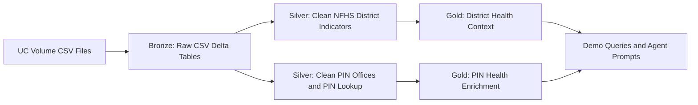

# Virtue Foundation Hackathon 2026

This is a Databricks bundle starter for the DAIS 2026 hackathon. It enriches India healthcare facility analysis with public postal geography and district-level public health indicators.

## Team and Challenge

Team:

- [Vibhu Ganesan](https://www.linkedin.com/in/vibhu-g-83313723)
- [Devesh Padmanabhan](https://www.linkedin.com/in/deveshpa/)

Hackathon problem track: Problem 4, Data Readiness Desk: what must be fixed before planning can trust it?

Official event page: [Databricks Apps & Agents for Good Hackathon 2026](https://developers.databricks.com/hackathon/apps-agents-for-good-2026).

Our focus is to make uncertain healthcare geography and public-health indicators reviewable before downstream planning or agentic recommendations depend on them.

## Table of Contents

- [Virtue Foundation Hackathon 2026](#virtue-foundation-hackathon-2026)
  - [Team and Challenge](#team-and-challenge)
  - [Table of Contents](#table-of-contents)
  - [What This Builds](#what-this-builds)
  - [Data Sources](#data-sources)
  - [Project Layout](#project-layout)
  - [Developer Workflow](#developer-workflow)
  - [Setup](#setup)
  - [Run the Pipeline](#run-the-pipeline)
  - [Outputs](#outputs)
  - [Data Quality Position](#data-quality-position)
  - [Agentic Demo Ideas](#agentic-demo-ideas)

## What This Builds

The pipeline ingests two CSV files from a Unity Catalog Volume, applies bronze/silver/gold medallion layers, and publishes demo-ready Delta tables.



## Data Sources

- India Post PIN Code Directory: `india_post_pincode_directory.csv`
- NFHS-5 District Health Indicators: `nfhs5_district_health_indicators.csv`

Both datasets are public-sector datasets published through data.gov.in under the Government Open Data License - India. See [Data Dictionary](docs/data_dictionary.md) for expected columns and semantics.

## Project Layout

- [app](app): Streamlit Databricks App scaffold for cached Trust Verdict reads
- [config/scoring.yaml](config/scoring.yaml): tunable Trust Verdict thresholds and quota-safety defaults
- [data](data): landing folder and upload guide for Vibhu's source files
- [databricks.yml](databricks.yml): Databricks bundle job and variables
- [notebooks/01_ingest_bronze.py](notebooks/01_ingest_bronze.py): CSV ingestion from Unity Catalog Volume
- [notebooks/02_build_silver.py](notebooks/02_build_silver.py): cleanup, geography normalization, and quality flags
- [notebooks/03_build_gold.py](notebooks/03_build_gold.py): enrichment-ready gold outputs
- [notebooks/04_demo_queries.py](notebooks/04_demo_queries.py): demo queries and an agent prompt
- [src/data_readiness_desk](src/data_readiness_desk): reusable helpers with local tests
- [contracts](contracts): machine-readable source dataset contracts and quality expectations
- [docs](docs): architecture, diagrams, decision log, data quality, and demo narrative
- [tests](tests): local tests for pure Python normalization helpers

## Developer Workflow

Use [justfile](justfile) for discoverable local commands:

```bash
just --list
just install
just ci
just validate-bundle dev
```

Copy [.env.example](.env.example) when configuring local Databricks OAuth credentials. Never commit real `.env` files.

Key engineering references:

- [Architecture](docs/architecture.md)
- [Diagrams](docs/diagrams.md)
- [Decision Log](docs/decision_log.md)
- [Governance](docs/governance.md)
- [Implementation Status](docs/implementation_status.md)
- [Data Quality Decisions](docs/data_quality.md)
- [Data Dictionary](docs/data_dictionary.md)

## Setup

1. Create or choose a Unity Catalog catalog and schema for the hackathon, for example `data_readiness_desk.pipeline`.
1. Create a UC Volume directory for source files, for example `/Volumes/data_readiness_desk/bronze/files`.
1. Upload the two source CSV files into that directory:
   - `/Volumes/data_readiness_desk/bronze/files/india_post_pincode_directory.csv`
   - `/Volumes/data_readiness_desk/bronze/files/nfhs5_district_health_indicators.csv`
1. Confirm the Databricks CLI is authenticated:

```bash
databricks auth profiles
```

1. Validate the bundle from this directory:

```bash
databricks bundle validate --target dev
```

> [!NOTE]
> The default variables assume `catalog=data_readiness_desk`, `schema=pipeline`, and `source_volume_path=/Volumes/data_readiness_desk/bronze/files`. Override these with bundle variables if your workspace uses different names.
> This project intentionally uses [databricks.yml](databricks.yml) because it is the standard Databricks bundle entrypoint. Other YAML files use the `.yaml` extension. Databricks now calls Databricks Asset Bundles Declarative Automation Bundles, but the CLI command remains `databricks bundle`.

## Run the Pipeline

Deploy and run the Databricks job:

```bash
databricks bundle deploy --target dev
databricks bundle run virtue_foundation_pipeline --target dev
```

Override variables if needed:

```bash
databricks bundle run virtue_foundation_pipeline --target dev --var catalog=my_catalog --var schema=my_schema --var source_volume_path=/Volumes/my_catalog/bronze/files
```

You can also run the notebooks manually in Databricks in this order:

1. [notebooks/00_preflight.py](notebooks/00_preflight.py)
1. [notebooks/01_ingest_bronze.py](notebooks/01_ingest_bronze.py)
1. [notebooks/02_build_silver.py](notebooks/02_build_silver.py)
1. [notebooks/03_build_gold.py](notebooks/03_build_gold.py)
1. [notebooks/04_demo_queries.py](notebooks/04_demo_queries.py)

## Outputs

Bronze tables:

- `bronze_facilities`
- `bronze_india_post_pincode_directory`
- `bronze_nfhs5_district_health_indicators`
- `bronze_hmis_2019_20_slice`
- `bronze_srs`
- `bronze_district_boundaries`

Silver tables:

- `silver_pincode_post_offices`
- `silver_pincode_lookup`
- `silver_nfhs_indicator_quality_long`
- `silver_nfhs5_district_health_indicators`
- `silver_hmis_2019_20_long`
- `pipeline_quality_checks`

Gold tables:

- `gold_facility_verdicts`
- `gold_district_health_context`
- `gold_pincode_health_enrichment`
- `gold_underserved_district_candidates`
- `gold_district_verdicts`
- `gold_fix_ranking`
- `gold_coverage_predictions`
- `gold_hmis_state_indicator_summary`

## Data Quality Position

This project does not pretend that postal geography is exact. The PIN code directory row grain is post office, not PIN code, so the silver layer creates a join-safe PIN lookup and flags ambiguous PIN geography before any health enrichment.

NFHS `*` values are treated as unavailable, not zero. Parenthesized values such as `(29.5)` are parsed as numeric values and flagged as low-sample estimates.

See [Data Quality Decisions](docs/data_quality.md) for the detailed handling rules.

## Agentic Demo Ideas

The final notebook prints an agent prompt that can be used with a Databricks assistant or an app-layer agent. Good demo tasks:

- Explain which districts deserve deeper healthcare access review and why.
- Identify ambiguous PIN codes that should not be joined directly to facility records.
- Generate validation questions for facilities whose postal district conflicts with coordinate-derived district.
- Summarize data quality cautions for a selected state.

See [Demo Script](docs/demo_script.md) for a judge-friendly walkthrough.
