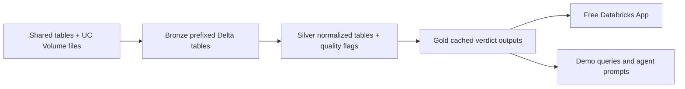

# Data Readiness Desk

Data Readiness Desk is a DAIS 2026 hackathon project for answering one planning question: "Can I trust this healthcare data for a place, condition, or facility?"

The project runs as a Databricks Declarative Automation Bundle, writes governed Delta tables in Unity Catalog, and serves cached Trust Verdict outputs through a Free Databricks App.

## Live Demo

Current dev app:

[Data Readiness Desk App](https://data-readiness-desk-7474647240221945.aws.databricksapps.com)

The app is read-only. It queries cached gold outputs only and does not run live training, live AI extraction, or table writes during the demo. The URL is not anonymous internet-public; viewers need Databricks workspace access and `CAN_USE` permission on the app.

## Team and Challenge

Team:

- [Vibhu Ganesan](https://www.linkedin.com/in/vibhu-g-83313723)
- [Devesh Padmanabhan](https://www.linkedin.com/in/deveshpa/)

Hackathon problem track: Problem 4, Data Readiness Desk: what must be fixed before planning can trust it?

Official event page: [Databricks Apps & Agents for Good Hackathon 2026](https://developers.databricks.com/hackathon/apps-agents-for-good-2026).

Our focus is to make uncertain healthcare geography and public-health indicators reviewable before downstream planning or agentic recommendations depend on them.

## Table of Contents

- [Data Readiness Desk](#data-readiness-desk)
  - [Live Demo](#live-demo)
  - [Team and Challenge](#team-and-challenge)
  - [Table of Contents](#table-of-contents)
  - [What This Builds](#what-this-builds)
  - [Data Sources](#data-sources)
  - [Project Layout](#project-layout)
  - [Developer Workflow](#developer-workflow)
  - [Setup](#setup)
  - [Run the Pipeline](#run-the-pipeline)
  - [Deploy the App](#deploy-the-app)
  - [Outputs](#outputs)
  - [Data Quality Position](#data-quality-position)
  - [Agentic Demo Ideas](#agentic-demo-ideas)
  - [Contributing](#contributing)

## What This Builds

The pipeline combines shared Databricks tables and file-based public sources, applies bronze/silver/gold medallion layers using layer-prefixed tables in `data_readiness_desk.pipeline`, and publishes demo-ready cached outputs.



## Data Sources

- Shared Virtue Foundation facilities table: `databricks_virtue_foundation_dataset_dais_2026.virtue_foundation_dataset.facilities`
- HMIS 2019-20 state-grain slice: `hmis_2019_20_slice.csv`
- SRS 2020 state file: `srs_2020_state.csv`
- India district boundaries: `india_districts.geojson`
- Optional India Post PIN Code Directory: `india_post_pincode_directory.csv`
- Optional NFHS-5 District Health Indicators: `nfhs5_district_health_indicators.csv`

Current demo-ready outputs use the shared facilities table plus HMIS/SRS/boundary files. PIN/NFHS-dependent gold tables are intentionally empty until those sources are available. See [Data Dictionary](docs/data_dictionary.md) for expected columns and semantics.

## Project Layout

- [app](app): Free Databricks App for cached Trust Verdict reads
- [config/scoring.yaml](config/scoring.yaml): tunable Trust Verdict thresholds and quota-safety defaults
- [data](data): local source file guidance
- [databricks.yml](databricks.yml): Databricks bundle job and variables
- [notebooks/00_preflight.py](notebooks/00_preflight.py): pre-run source and access checks
- [notebooks/01_ingest_bronze.py](notebooks/01_ingest_bronze.py): shared table and file ingestion
- [notebooks/02_build_silver.py](notebooks/02_build_silver.py): cleanup, geography normalization, and quality flags
- [notebooks/03_build_gold.py](notebooks/03_build_gold.py): cached gold outputs
- [notebooks/04_demo_queries.py](notebooks/04_demo_queries.py): demo queries and an agent prompt
- [scripts](scripts): workspace bootstrap, grants, app deploy, fetchers, and query helpers
- [src/data_readiness_desk](src/data_readiness_desk): reusable helpers with local tests
- [contracts](contracts): machine-readable source dataset contracts and quality expectations
- [docs](docs): architecture, diagrams, decision log, data quality, and demo narrative
- [tests](tests): local tests for pure Python normalization helpers

## Developer Workflow

Use [justfile](justfile) for discoverable local commands:

```bash
just --list
just install
just ci
just validate-bundle dev
just deploy-app
```

Copy [.env.example](.env.example) when configuring local Databricks OAuth credentials. Never commit real `.env` files.

Key engineering references:

- [Architecture](docs/architecture.md)
- [Diagrams](docs/diagrams.md)
- [Decision Log](docs/decision_log.md)
- [Governance](docs/governance.md), including the [Databricks object hierarchy](docs/governance.md#databricks-object-hierarchy)
- [Implementation Status](docs/implementation_status.md)
- [Data Quality Decisions](docs/data_quality.md)
- [Data Dictionary](docs/data_dictionary.md)

## Setup

1. Configure Databricks service-principal OAuth using [.env.example](.env.example).
1. Confirm the Databricks CLI is authenticated:

```bash
set -a
source "/Users/dpadmanabhan/code/labs/tmp/.env"
set +a
databricks current-user me
```

1. Install local tooling and validate:

```bash
just install
just ci
databricks bundle validate --target dev
```

1. Bootstrap Unity Catalog objects and upload available local files:

```bash
./scripts/bootstrap_databricks_workspace.sh \
  --warehouse-id 4e307d33a4466b55 \
  --catalog data_readiness_desk \
  --schema pipeline \
  --volume-schema bronze \
  --volume files
```

> [!NOTE]
> The default variables assume `catalog=data_readiness_desk`, `schema=pipeline`, and `source_volume_path=/Volumes/data_readiness_desk/bronze/files`. Override these with bundle variables if your workspace uses different names.
> This project intentionally uses [databricks.yml](databricks.yml) because it is the standard Databricks bundle entrypoint. Other YAML files use the `.yaml` extension. Databricks now calls Databricks Asset Bundles Declarative Automation Bundles, but the CLI command remains `databricks bundle`.

## Run the Pipeline

Deploy and run the Databricks job:

```bash
databricks bundle deploy --target dev
databricks bundle run virtue_foundation_pipeline --target dev
```

Override variables if needed:

```bash
databricks bundle run virtue_foundation_pipeline --target dev --var catalog=my_catalog --var schema=my_schema --var source_volume_path=/Volumes/my_catalog/bronze/files
```

Query cached outputs:

```bash
./scripts/query_readiness_outputs.sh --warehouse-id 4e307d33a4466b55
```

You can also run the notebooks manually in Databricks in this order:

1. [notebooks/00_preflight.py](notebooks/00_preflight.py)
1. [notebooks/01_ingest_bronze.py](notebooks/01_ingest_bronze.py)
1. [notebooks/02_build_silver.py](notebooks/02_build_silver.py)
1. [notebooks/03_build_gold.py](notebooks/03_build_gold.py)
1. [notebooks/04_demo_queries.py](notebooks/04_demo_queries.py)

## Deploy the App

Deploy the Free Databricks App from the repository root:

```bash
./scripts/deploy_databricks_app.sh
```

Current dev deployment:

- App name: `data-readiness-desk`
- URL: [Data Readiness Desk App](https://data-readiness-desk-7474647240221945.aws.databricksapps.com)
- Active deployment: `01f1693344c2144b930678887ba328ea`

## Outputs

All tables are in `data_readiness_desk.pipeline`.

Verified demo-ready outputs:

- `silver_facilities_geo`: 10,088 rows
- `gold_facility_verdicts`: 255 rows
- `gold_hmis_state_indicator_summary`: 38 rows
- `pipeline_quality_checks`: 9 rows

Bronze tables:

- `bronze_facilities`
- `bronze_india_post_pincode_directory`
- `bronze_nfhs5_district_health_indicators`
- `bronze_hmis_2019_20_slice`
- `bronze_srs`
- `bronze_district_boundaries`

Silver tables:

- `silver_pincode_post_offices`
- `silver_pincode_lookup`
- `silver_nfhs_indicator_quality_long`
- `silver_nfhs5_district_health_indicators`
- `silver_hmis_2019_20_long`
- `silver_facilities_geo`
- `pipeline_quality_checks`

Gold tables:

- `gold_facility_verdicts`
- `gold_hmis_state_indicator_summary`
- `gold_district_health_context`
- `gold_pincode_health_enrichment`
- `gold_underserved_district_candidates`
- `gold_district_verdicts`
- `gold_fix_ranking`
- `gold_coverage_predictions`
- `gold_hmis_state_indicator_summary`

## Data Quality Position

This project does not pretend that postal geography is exact. The PIN code directory row grain is post office, not PIN code, so the silver layer creates a join-safe PIN lookup and flags ambiguous PIN geography before any health enrichment.

NFHS `*` values are treated as unavailable, not zero. Parenthesized values such as `(29.5)` are parsed as numeric values and flagged as low-sample estimates.

See [Data Quality Decisions](docs/data_quality.md) for the detailed handling rules.

## Agentic Demo Ideas

The final notebook prints an agent prompt that can be used with a Databricks assistant or an app-layer agent. Good demo tasks:

- Explain which districts deserve deeper healthcare access review and why.
- Identify ambiguous PIN codes that should not be joined directly to facility records.
- Generate validation questions for facilities whose postal district conflicts with coordinate-derived district.
- Summarize data quality cautions for a selected state.

See [Demo Script](docs/demo_script.md) for a judge-friendly walkthrough.

## Contributing

Use [.github/CONTRIBUTING.md](.github/CONTRIBUTING.md) for contribution workflow, validation commands, and commit style. Pull requests should use [.github/PULL_REQUEST_TEMPLATE.md](.github/PULL_REQUEST_TEMPLATE.md).
