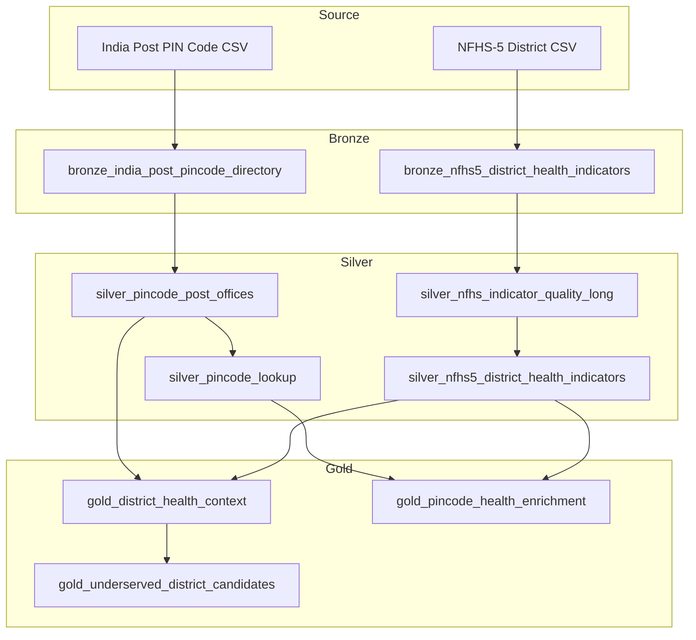

# Architecture

This project uses a simple medallion architecture for hackathon speed while preserving the data-quality decisions needed for credible analysis.

Hackathon track: Problem 4, Data Readiness Desk. The architecture is designed to answer what must be fixed before healthcare planning can trust the data.

## Table of Contents

- [Goals](#goals)
- [Data Flow](#data-flow)
- [Layer Responsibilities](#layer-responsibilities)
- [Design Choices](#design-choices)
- [Future Extensions](#future-extensions)

## Goals

- Ingest public CSV files from a Unity Catalog Volume.
- Publish Delta tables with explicit bronze, silver, and gold layers.
- Preserve ambiguity instead of forcing uncertain geography into exact joins.
- Create demo-ready tables for district health context and facility enrichment.
- Surface readiness issues as first-class outputs for planners and agents.

## Data Flow

## Layer Responsibilities

Bronze keeps source rows close to their raw CSV shape and adds ingestion metadata.

Silver standardizes column names, normalizes state and district strings, parses NFHS values, and creates a PIN lookup that is safe to join without row fanout.

Gold creates outputs for the hackathon story:

- District-level health context with postal coverage summaries
- PIN-to-health enrichment with match-status transparency
- Underserved district candidate rankings for demo exploration

## Design Choices

- The pipeline overwrites hackathon tables on each run. That keeps the demo idempotent and easy to reset.
- Unity Catalog three-part names are used throughout via `catalog` and `schema` bundle variables.
- The source Volume path is configurable so the same bundle can run in different workspaces.
- The PIN lookup preserves ambiguity using `district_count`, `state_count`, and `is_geography_ambiguous`.
- NFHS quality flags are retained in a long-form table to support transparent explanations.

## Future Extensions

- Add facility input data and enrich facilities through `gold_pincode_health_enrichment`.
- Add spatial point-in-polygon assignment for facilities with latitude and longitude.
- Add Databricks SQL dashboards over the gold tables.
- Add a serving endpoint or app-layer agent that answers questions using only gold tables.
