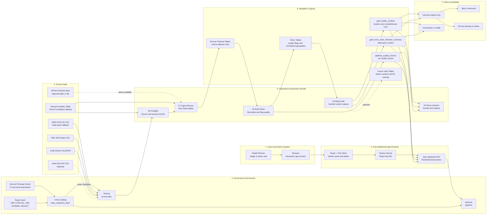
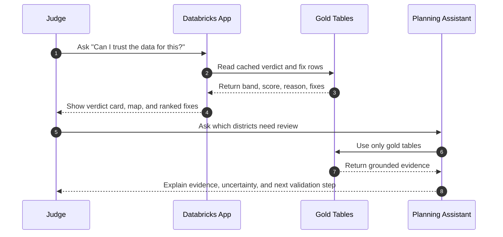
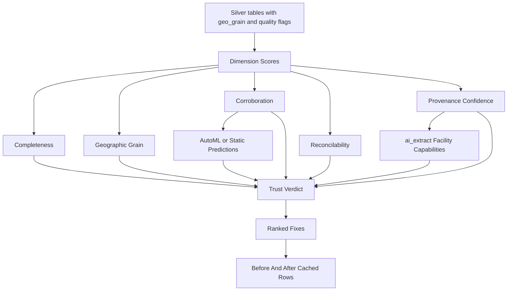
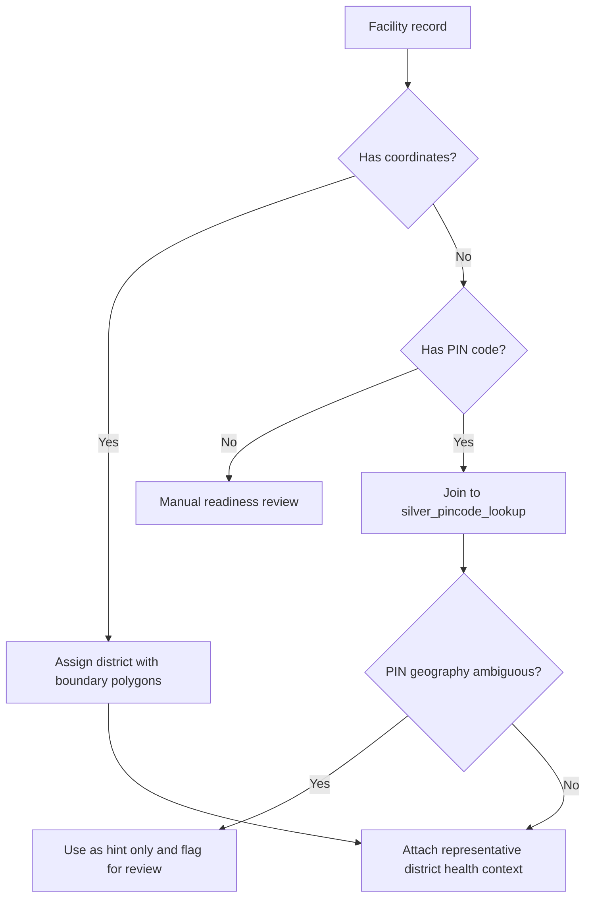

# Diagrams

These diagrams are version-controlled Mermaid diagrams so they render in GitHub and remain reviewable with the code.

## Table of Contents

- [Diagrams](#diagrams)
  - [Table of Contents](#table-of-contents)
  - [Target State Architecture](#target-state-architecture)
  - [Demo Flow](#demo-flow)
  - [Scoring Pipeline](#scoring-pipeline)
  - [PIN Readiness Decision](#pin-readiness-decision)

## Target State Architecture

## Demo Flow

## Scoring Pipeline

## PIN Readiness Decision

